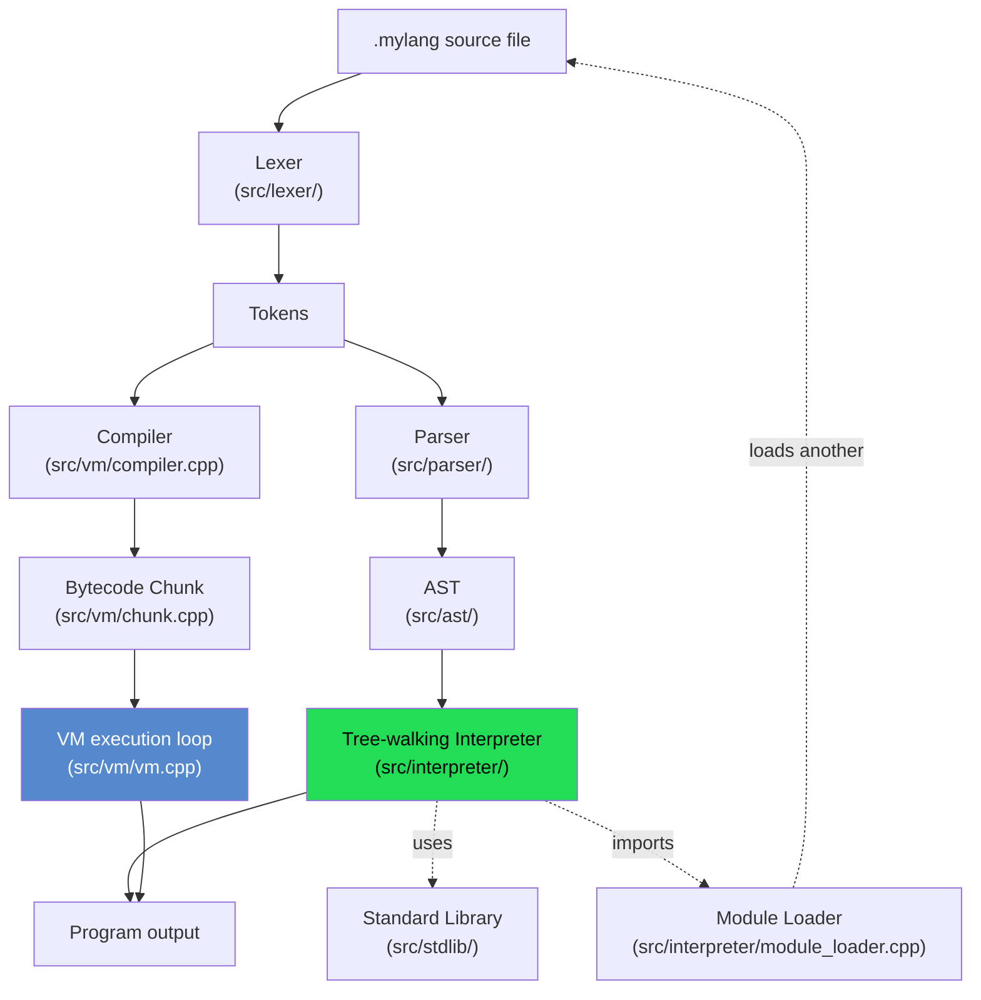

# mylang

A dynamically-typed, interpreted scripting language built from scratch
in C++ — plus an in-progress bytecode VM as a second, faster execution
engine for the same language.

## System workflow



Two independent execution paths share the same `Lexer`/`Token` front
end, then diverge:

- **Tree-walking interpreter** (default) — full language support:
  functions/closures, classes/inheritance, arrays, maps, imports, and
  the whole standard library. `./mylang script.mylang`
- **Bytecode VM** (`--vm` flag, in progress) — compiles to a flat
  instruction stream and runs it on a stack-based loop instead of
  walking the AST. Currently supports: arithmetic, `print`, global and
  local variables with block scoping. `./mylang --vm script.mylang`

See `docs/vm-notes.md` for why there are two engines and how the VM is
being built out incrementally.

## Build

**With g++ directly:**
```bash
g++ -std=c++17 -Isrc src/main.cpp src/lexer/lexer.cpp src/parser/parser.cpp src/interpreter/environment.cpp src/interpreter/interpreter.cpp src/interpreter/user_function.cpp src/interpreter/value.cpp src/interpreter/lox_class.cpp src/interpreter/lox_instance.cpp src/interpreter/array_methods.cpp src/interpreter/map_methods.cpp src/interpreter/module_object.cpp src/interpreter/module_loader.cpp src/stdlib/native_function.cpp src/stdlib/math_lib.cpp src/stdlib/string_lib.cpp src/stdlib/io_lib.cpp src/stdlib/array_lib.cpp src/stdlib/type_lib.cpp src/stdlib/map_lib.cpp src/stdlib/stdlib.cpp src/vm/chunk.cpp src/vm/compiler.cpp src/vm/vm.cpp -o mylang
```

**With CMake:**
```bash
cmake -B build
cmake --build build
```

## Run

**Tree-walking interpreter (default, full language support):**
```bash
./mylang path/to/script.mylang
```

**Bytecode VM (in progress):**
```bash
./mylang --vm path/to/script.mylang
./mylang --vm          # VM REPL
```

## Docs

See `docs/language-spec.md` for the language grammar/semantics, and
`docs/vm-notes.md` for the bytecode VM's design and current status.